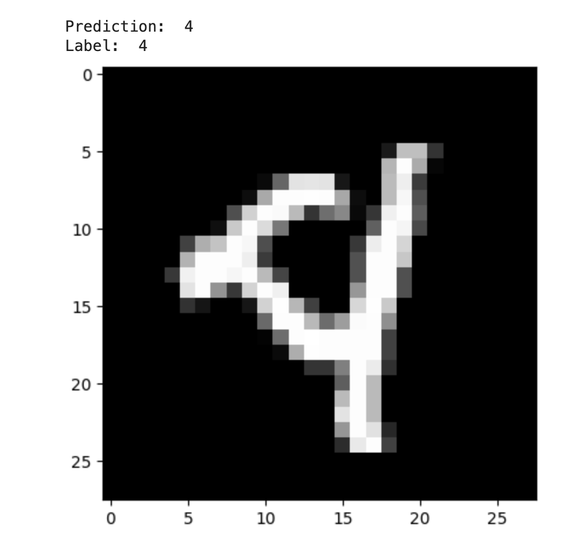

# MNIST Digit Classification

## Overview
This project features a custom-built multi-layer perceptron (MLP) for MNIST digit classification, uniquely created without standard deep learning frameworks like PyTorch, TensorFlow, or Keras.

## Highlights
- **He Initialization & SGD:** Employs He initialization and Stochastic Gradient Descent for effective training.
- **Built with Numpy, Pandas, and Matplotlib:** Relies solely on these Python libraries for all computational, data handling, and visualization needs.

## Performance
Achieves ~91% accuracy on both training and test datasets in under 200 training iterations.

